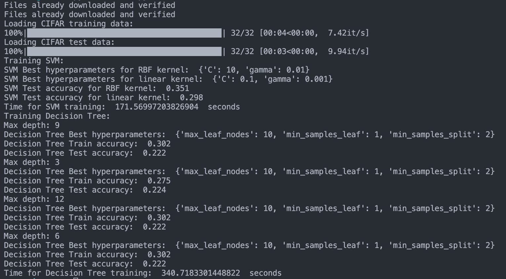
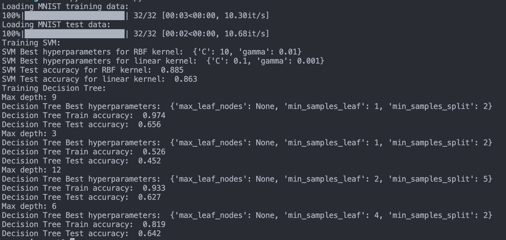

# Machine Learning Assignment#1

## Overview

The goal of this assignment is to implement and learn two machine learning algorithms, Decision Tree and Support Vector Machine (SVM), on two datasets: MNIST and CIFAR-10. The implementation codes should be written in Python and submitted as a zip file along with a pdf report that describes the experimental setup and results on train/test sets.

The report should follow a guideline provided for experimental setup with the PyTorch library. The guideline includes importing the necessary packages for learning, loading the data that will be used for learning, and concatenating the input images and their labels into numpy arrays for training and testing machine learning models.

For the Decision Tree algorithm, the implementation should manually set some hyperparameters involved, including tree depth (3, 6, 9, 12). The GridSearchCV should be used to perform cross-validation on hyperparameters.

## Code Overview

### CIFAR10

The `load_data()` function downloads the CIFAR-10 dataset and creates two data loaders, one for training data and one for testing data, with batch size 32, shuffle as True for training set, and shuffle as False for testing set.

```py
def load_data():
      CIFAR_transform_train = transforms.Compose([transforms.ToTensor()])
      CIFAR_transform_test = transforms.Compose([transforms.ToTensor()])

      trainset_CIFAR = datasets.CIFAR10(
            root='./datasets/cifar10/train',
            train=True,
            download=True,
            transform=CIFAR_transform_train
      )

      testset_CIFAR = datasets.CIFAR10(
            root='./datasets/cifar10/test',
            train=False,
            download=True,
            transform=CIFAR_transform_test
      )

      CIFAR_train = DataLoader(trainset_CIFAR, batch_size=32, shuffle=True, num_workers=2)
      CIFAR_test = DataLoader(testset_CIFAR, batch_size=32, shuffle=False, num_workers=2)

      return CIFAR_train, CIFAR_test
```

The `train_svm()` function trains two SVM models, one with an RBF kernel and one with a linear kernel, using grid search to find the best hyperparameters. It then trains new models with the best hyperparameters and evaluates their performance on the test set, reporting their accuracy scores.

```py
def train_svm(train_images, train_labels, test_images, test_labels) -> None:
    param_grid = {
        'C': [0.1, 1, 10],
        'gamma': [0.001, 0.01, 0.1]
    }
    svm_model_rbf = svm.SVC(kernel='rbf')
    svm_model_linear = svm.SVC(kernel='linear')
    svm_grid_search_rbf = GridSearchCV(svm_model_rbf, param_grid, cv=5)
    svm_grid_search_linear = GridSearchCV(svm_model_linear, param_grid, cv=5)

    svm_grid_search_rbf.fit(train_images, train_labels)
    svm_grid_search_linear.fit(train_images, train_labels)
    print("SVM Best hyperparameters for RBF kernel: ", svm_grid_search_rbf.best_params_)
    print("SVM Best hyperparameters for linear kernel: ", svm_grid_search_linear.best_params_)

    svm_model_rbf_best = svm.SVC(kernel='rbf', C=svm_grid_search_rbf.best_params_['C'], gamma=svm_grid_search_rbf.best_params_['gamma'])
    svm_model_linear_best = svm.SVC(kernel='linear', C=svm_grid_search_linear.best_params_['C'])
    svm_model_rbf_best.fit(train_images, train_labels)
    svm_model_linear_best.fit(train_images, train_labels)

    svm_predictions_rbf = svm_model_rbf_best.predict(test_images)
    svm_predictions_linear = svm_model_linear_best.predict(test_images)
    svm_accuracy_rbf = accuracy_score(test_labels, svm_predictions_rbf)
    svm_accuracy_linear = accuracy_score(test_labels, svm_predictions_linear)
    print("SVM Test accuracy for RBF kernel: ", svm_accuracy_rbf)
    print("SVM Test accuracy for linear kernel: ", svm_accuracy_linear)
```

The `train_decision_tree()` function trains a decision tree classifier with different max depths and grid search to find the best hyperparameters. It then trains new models with the best hyperparameters and evaluates their performance on both the training and test sets, reporting their accuracy scores.

```py
def train_decision_tree(train_images, train_labels, test_images, test_labels) -> None:
    depths = set([3, 6, 9, 12])
    param_grid = {
        'min_samples_split': [2, 5, 10],
        'min_samples_leaf': [1, 2, 4],
        'max_leaf_nodes': [5, 10, None]
    }

    for depth in depths:
        print("Max depth:", depth)
        tree_model = DecisionTreeClassifier(max_depth=depth)
        tree_grid_search = GridSearchCV(tree_model, param_grid, cv=5)
        tree_grid_search.fit(train_images, train_labels)
        print("Decision Tree Best hyperparameters: ", tree_grid_search.best_params_)

        tree_model_best = DecisionTreeClassifier(
            max_depth=depth,
            min_samples_split=tree_grid_search.best_params_['min_samples_split'],
            min_samples_leaf=tree_grid_search.best_params_['min_samples_leaf'],
            max_leaf_nodes=tree_grid_search.best_params_['max_leaf_nodes']
        )
        tree_model_best.fit(train_images, train_labels)
        tree_train_predictions = tree_model_best.predict(train_images)
        tree_train_accuracy = accuracy_score(train_labels, tree_train_predictions)
        print("Decision Tree Train accuracy: ", tree_train_accuracy)

        tree_test_predictions = tree_model_best.predict(test_images)
        tree_test_accuracy = accuracy_score(test_labels, tree_test_predictions)
        print("Decision Tree Test accuracy: ", tree_test_accuracy)
```

The `main()` function loads the CIFAR-10 dataset using the `load_data()` function and iterates over the training and testing data batches, flattening the images and storing them in numpy arrays for use in training the SVM and decision tree models.

```py
def main() -> None:
      CIFAR_train_loader, CIFAR_test_loader = load_data()
      CIFAR_train_images, CIFAR_train_labels = None, None

      print("Loading CIFAR training data:")
      for batch in tqdm(CIFAR_train_loader):
            images, labels = batch
            images_flat = images.view(images.shape[0], -1)
            if CIFAR_train_images is None:
                  CIFAR_train_images = images_flat.numpy()
                  CIFAR_train_labels = labels.numpy()
            else:
                  CIFAR_train_images = np.vstack([CIFAR_train_images, images_flat.numpy()])
                  CIFAR_train_labels = np.concatenate([CIFAR_train_labels, labels.numpy()])

      CIFAR_test_images, CIFAR_test_labels = None, None
      print("Loading CIFAR test data:")
      for batch in tqdm(CIFAR_test_loader):
            images, labels = batch
            images_flat = images.view(images.shape[0], -1)
            if CIFAR_test_images is None:
                  CIFAR_test_images = images_flat.numpy()
                  CIFAR_test_labels = labels.numpy()
            else:
                  CIFAR_test_images = np.vstack([CIFAR_test_images, images_flat.numpy()])
                  CIFAR_test_labels = np.concatenate([CIFAR_test_labels, labels.numpy()])

      print("Training SVM:")
      start_time = time.time()
      train_svm(CIFAR_train_images, CIFAR_train_labels, CIFAR_test_images, CIFAR_test_labels)
      end_time = time.time()
      print("Time for SVM training: ", end_time - start_time, " seconds")

      print("Training Decision Tree:")
      start_time = time.time()
      train_decision_tree(CIFAR_train_images, CIFAR_train_labels, CIFAR_test_images, CIFAR_test_labels)
      end_time = time.time()
      print("Time for Decision Tree training: ", end_time - start_time, " seconds")
```

Overall, this code is used to experiment with different models and hyperparameters to find the best classification model for the CIFAR-10 dataset.

### MNIST

Overall the code is almost identical to the code shown previously but it uses `datasets.MNIST()` instead of `datasets.CIFAR10()` to load MNIST training and test datasets.

The `train_svm()` function trains two SVM models on the training data, one using an RBF kernel and the other using a linear kernel. It performs a grid search over hyperparameters to find the best values for C and gamma for the RBF kernel and the best value for C for the linear kernel. It then evaluates the models on the test data and prints the test accuracies.

The `train_decision_tree()` function trains a decision tree on the training data with different maximum depths, performing another grid search over hyperparameters to find the best values for `min_samples_split`, `min_samples_leaf`, and `max_leaf_nodes`. It then evaluates the model on both the training and test data and prints the accuracies.

Finally, `the main()` function loads the data, trains the SVM and decision tree models, and prints the accuracies. The data is loaded in batches using `torch.utils.data.DataLoader`, and the batches are flattened and concatenated to form the full training and test datasets. The tqdm library is used to display progress bars during the data loading process.

## Results

> Please note that the results provided below are from small subsets of the CIFAR10 and MNIST datasets. As such, the reported time and accuracy may not accurately reflect the performance on the full dataset.

### CIFAR-10

**<u>SVM:</u>**

**RBF kernel**
- Test accuracy: 0.351
- Best hyperparameters: {'C': 10, 'gamma': 0.01}
**Linear kernel**
- Test accuracy: 0.298
- Best hyperparameters: {'C': 0.1, 'gamma': 0.001}

**<u>Decision Tree</u>**

**Max Depth: 3**
- Train accuracy: 0.275
- Test accuracy: 0.224
- Best hyperparameters: {'max_leaf_nodes': 10, 'min_samples_leaf': 1, 'min_samples_split': 2}

**Max Depth: 6**
- Train accuracy: 0.302
- Test accuracy: 0.222
- Best hyperparameters: {'max_leaf_nodes': 10, 'min_samples_leaf': 1, 'min_samples_split': 2}

**Max Depth: 9**
- Train accuracy: 0.302
- Test accuracy: 0.222
- Best hyperparameters: {'max_leaf_nodes': 10, 'min_samples_leaf': 1, 'min_samples_split': 2}

**Max Depth: 12**
- Train accuracy: 0.302
- Test accuracy: 0.222
- Best hyperparameters: {'max_leaf_nodes': 10, 'min_samples_leaf': 1, 'min_samples_split': 2}



### MNIST Results

**<u>SVM:</u>**

**RBF kernel**
- Test accuracy: 0.885
- Best hyperparameters: {'C': 10, 'gamma': 0.01}

**Linear kernel**
- Test accuracy: 0.863
- Best hyperparameters: {'C': 0.1, 'gamma': 0.001}

**<u>Decision Tree</u>**

**Max Depth: 3**
- Train accuracy: 0.526
- Test accuracy: 0.452
- Best hyperparameters: {'max_leaf_nodes': None, 'min_samples_leaf': 1, 'min_samples_split': 2}

**Max Depth: 6**
- Train accuracy: 0.819
- Test accuracy: 0.642
- Best hyperparameters: {'max_leaf_nodes': None, 'min_samples_leaf': 4, 'min_samples_split': 2}

**Max Depth: 9**
- Train accuracy: 0.974
- Test accuracy: 0.656
- Best hyperparameters: {'max_leaf_nodes': None, 'min_samples_leaf': 1, 'min_samples_split': 2}

**Max Depth: 12**
- Train accuracy: 0.933
- Test accuracy: 0.627
- Best hyperparameters: {'max_leaf_nodes': None, 'min_samples_leaf': 2, 'min_samples_split': 5}

